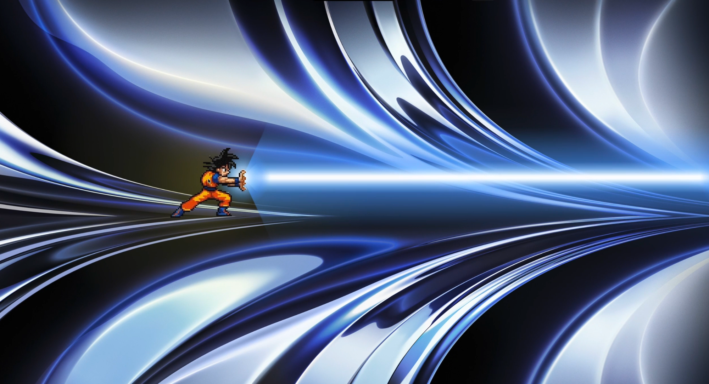

# kameha

**Goku lives on your desktop.**

A menu-bar app that puts a fully interactive Dragon Ball Z Goku sprite on your screen. Hold to charge. Release to blast. Double-click for Instant Transmission.

[](https://www.npmjs.com/package/kameha)
[](https://www.electronjs.org/)
[](#platform-support)
[](LICENSE)
[](https://github.com/shubham-bhatnagar-78/kameha/pulls)

[**Install**](#install) · [**Controls**](#controls) · [**Platform support**](#platform-support) · [**For nerds**](#for-nerds)

---

[](https://youtu.be/mK7waowFQa8)

---

## Install

### Option A — npm (recommended)

```bash
npm install -g kameha
kameha
```

### Option B — clone and run

```bash
git clone https://github.com/shubham-bhatnagar-78/kameha
cd kameha
npm install
npm start
```

Goku appears in your menu bar. Click the Z icon to summon him.

---

## Controls

| Action | What happens |
|--------|-------------|
| **Click anywhere** | Fire a quick kamehameha beam |
| **Hold mouse button** | Charge up — the longer you hold, the bigger the blast |
| **Release after a long hold** | Unleash the full kamehameha |
| **Double-click Goku** | Instant Transmission — gone in a white flash |
| **Escape** | Hide Goku |

Goku follows your cursor everywhere. The charge bar shows how much power you've built up. Hold long enough and the screen starts shaking.

---

## Platform support

| Platform | Status | Notes |
|----------|--------|-------|
| **macOS** | ✅ First-class | First launch may prompt for Accessibility permission |
| **Windows** | ✅ Works | Native focus restore needs the optional `koffi` dep — auto-installed when available |
| **Linux** | ⚠️ Partial | Works on X11. Wayland + GNOME tray is flaky (Electron limitation) |

---

## Roadmap

- [ ] Global keyboard shortcut to summon Goku without clicking the tray
- [ ] More sprites — Vegeta, Gohan, Piccolo
- [ ] Volume control in the tray menu
- [ ] Multi-monitor — spawn on whichever screen the cursor is on
- [ ] Wayland support

Have an idea? [Open an issue](https://github.com/shubham-bhatnagar-78/kameha/issues).

---

## Contributing

```bash
git clone https://github.com/YOUR_USERNAME/kameha
cd kameha
npm install
npm run dev
```

The animation engine lives entirely in `overlay.html` — no build step. Edit and reload.

---

## For nerds

kameha is an [Electron](https://www.electronjs.org/) tray app that renders a transparent, always-on-top, click-through overlay spanning your entire screen.

### How the overlay works

- **Sprite sheet parsing** — the 3-frame PNG is sliced at startup by detecting non-background pixel column runs. Each frame is flood-fill masked (exterior white keyed out, interior whites like eye detail preserved) and cached as an offscreen canvas.
- **Pose crossfading** — `frameAlpha[0..2]` converges toward the active pose each frame at rate 0.28, blending idle / charge / fire instead of hard-cutting.
- **Cursor following** — `anchorX/Y` lerps toward `targetX/Y` each frame. Lerp factor drops 0.62 → 0.12 while charging or firing so the hold pose doesn't jitter from small mouse movements.
- **Kamehameha beam** — three layered `createLinearGradient` passes (feather halo → outer blue → white-hot core) drawn into a tapered clipping path from Goku's hands to the screen edge. A `createRadialGradient` hand-flare and tip shockwave complete the effect.
- **Screen shake** — random `ctx.translate(sx, sy)` offset each frame once charge exceeds 30%, amplitude scaling linearly to ±14px at full charge.
- **Instant Transmission** — a radial gradient flash peaking at `vt=0.5` via quadratic envelope, paired with an implosion particle burst and audio cue.
- **Breathing** — sinusoidal squash-and-stretch anchored at the feet, runs independently of charge/fire state.

### How the main process works

`main.js` creates the overlay `BrowserWindow` with `transparent: true`, `focusable: false`, and `setIgnoreMouseEvents(true, { forward: true })` — all clicks pass through to the app underneath until the scene is active.

The tray icon is extracted from `icon/dbz-source.png` at runtime: logo pixels are detected by saturation heuristics, bounding-boxed, flood-fill masked, and resized to 30pt with a 2× `@2x` representation for Retina.

### Security

- `sandbox: true`, `contextIsolation: true`, `nodeIntegration: false` on the overlay window
- CSP blocks all external connections, frames, and object embeds — only local assets load
- IPC surface is minimal: hide, click-through toggle, native notification

### Project structure

```
kameha/
├── main.js           # Electron main — tray, overlay window, IPC
├── preload.js        # contextBridge — exposes bridge.* to overlay
├── overlay.html      # Entire animation engine (self-contained, no build step)
├── bin/
│   └── kameha.js     # CLI entry point
├── assets/
│   └── goku_sheet.png
├── sounds/
│   ├── kamehameha.mp3
│   ├── instant_transmission.mp3
│   └── *.mp3
└── icon/
    ├── dbz-source.png   # Source for runtime tray icon extraction
    ├── AppIcon.icns     # macOS fallback
    └── Template.png     # Monochrome menubar fallback
```

---

## Disclaimer

kameha is an unofficial fan project. Goku, Dragon Ball, and all related marks are property of Bird Studio / Shueisha / Toei Animation. No affiliation with Toei Animation or any rights holder.

---

## License

[MIT](LICENSE) — use it, fork it, ship it.

---

**If this made you smile, give it a ⭐**
