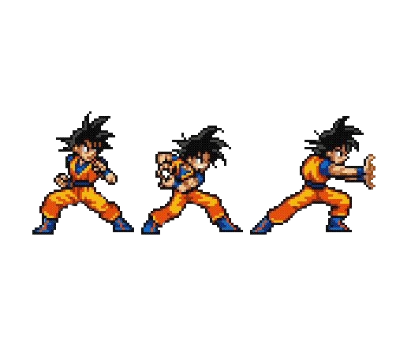

# kameha

**Goku lives on your desktop.**

A menu-bar app that puts a fully interactive Dragon Ball Z Goku sprite on your screen. Hold to charge. Release to blast. Double-click to vanish.

[](https://www.npmjs.com/package/kameha)
[](https://www.electronjs.org/)
[](#platform-support)
[](LICENSE)
[](https://github.com/shubham-bhatnagar-78/kameha/pulls)

[**Install**](#install) · [**Controls**](#controls) · [**How it works**](#how-it-works) · [**Contributing**](#contributing)

---



*Three-frame sprite: idle → charge → fire.*

---

## Install

### Option A — npm (recommended)

```bash
npm install -g kameha
kameha
```

### Option B — clone and run

```bash
git clone https://github.com/shubham-bhatnagar-78/kameha
cd kameha
npm install
npm start
```

Goku appears in your menu bar immediately. Click the icon to summon him.

---

## Controls

| Action | Result |
|--------|--------|
| **Click anywhere** | Fire a quick kamehameha beam |
| **Hold mouse button** | Charge up — bar fills as you hold |
| **Release after charging** | Unleash the full kamehameha |
| **Double-click Goku** | Instant Transmission — vanishes in a white flash |
| **Escape** | Panic hide — closes the overlay immediately |

Goku follows your cursor at all times. Charging past 70% triggers his cupped-hands pose and shakes the screen.

---

## How it works

kameha is an [Electron](https://www.electronjs.org/) tray app that renders a transparent, always-on-top, click-through overlay spanning your entire screen.

### Overlay

The overlay (`overlay.html`) uses the Canvas API:

- **Sprite sheet parsing** — a 3-frame PNG is sliced at startup by detecting non-background pixel column runs. Each frame is flood-fill masked (exterior white keyed out, interior whites like eye detail preserved) and cached as an offscreen canvas.
- **Pose crossfading** — `frameAlpha[0..2]` converges toward the active pose each frame at rate 0.28, producing a smooth blend between idle / charge / fire instead of a hard cut.
- **Cursor following** — `anchorX/Y` lerps toward `targetX/Y` each frame. Lerp factor drops from 0.62 → 0.12 while charging or firing, so the hold pose doesn't jitter from small mouse movements.
- **Kamehameha beam** — three layered `createLinearGradient` passes (feather halo → outer blue → white-hot core) drawn into a tapered clipping path from Goku's hands to the screen edge. A `createRadialGradient` hand-flare and tip shockwave complete the effect.
- **Screen shake** — a random `ctx.translate(sx, sy)` offset applied each frame once charge exceeds 30%. Amplitude scales linearly to ±14px at full charge.
- **Instant Transmission** — a `createRadialGradient` flash that peaks at `vt=0.5` via a quadratic envelope, paired with an implosion particle burst and the `instant_transmission.mp3` audio cue.
- **Breathing animation** — sinusoidal squash-and-stretch anchored at the feet (`stretchY` / `squashX`) runs independently of the charge/fire state.

### Main process

`main.js` creates the overlay `BrowserWindow` with `transparent: true`, `focusable: false`, and `setIgnoreMouseEvents(true, { forward: true })` so all clicks pass through to whatever's underneath — until the scene is active, at which point the overlay captures mouse events.

The tray icon is extracted from `icon/dbz-source.png` at runtime: logo pixels are detected by saturation heuristics, bounding-boxed, flood-fill masked, and resized to 30pt with a 2× `@2x` representation added for Retina displays.

---

## Project structure

```
kameha/
├── main.js           # Electron main — tray, overlay window, IPC
├── preload.js        # contextBridge — exposes bridge.* to overlay
├── overlay.html      # Entire animation engine (self-contained, no build step)
├── bin/
│   └── kameclaude.js # CLI entry point (kameha / npm start)
├── assets/
│   └── goku_sheet.png        # 3-frame sprite sheet
├── sounds/
│   ├── kamehameha.mp3         # Beam wind-up + fire audio
│   ├── instant_transmission.mp3
│   └── *.mp3                  # Ki charge audio layers
└── icon/
    ├── dbz-source.png  # Source for runtime tray icon extraction
    ├── AppIcon.icns    # macOS fallback
    └── Template.png    # Monochrome menubar fallback
```

---

## Platform support

| Platform | Status | Notes |
|----------|--------|-------|
| **macOS** | ✅ First-class | First launch may prompt for Accessibility permission (needed for focus restore after tray click) |
| **Windows** | ✅ Works | Native refocus requires the optional `koffi` dep — auto-installed when available |
| **Linux** | ⚠️ Partial | Works on X11. Wayland + GNOME tray support is flaky (known Electron limitation) |

---

## Roadmap

- [ ] **Configurable keybind** — global shortcut to toggle Goku without clicking the tray
- [ ] **More sprites** — Vegeta, Gohan, Piccolo variants
- [ ] **Sound volume control** — settings panel in the tray menu
- [ ] **Multi-monitor** — spawn on the screen where the cursor is
- [ ] **Windows tray polish** — native icon rendering without the `koffi` fallback
- [ ] **Wayland support** — track upstream Electron fixes

Have an idea? [Open an issue](https://github.com/shubham-bhatnagar-78/kameha/issues).

---

## Contributing

Contributions welcome — new sprites, audio, animation effects, or platform fixes.

```bash
# Fork and clone
git clone https://github.com/YOUR_USERNAME/kameha
cd kameha
npm install
npm run dev   # launches Electron directly (no detach)
```

The entire animation engine lives in `overlay.html`. It's a single self-contained file with no build step — edit and reload the overlay window to iterate.

---

## Disclaimer

kameha is an unofficial fan project. Goku, Dragon Ball, and all related marks are property of Bird Studio / Shueisha / Toei Animation. This project has no affiliation with Toei Animation or any rights holder.

---

## License

[MIT](LICENSE) — use it, fork it, ship it.

---

**If this made you smile, give it a ⭐**
